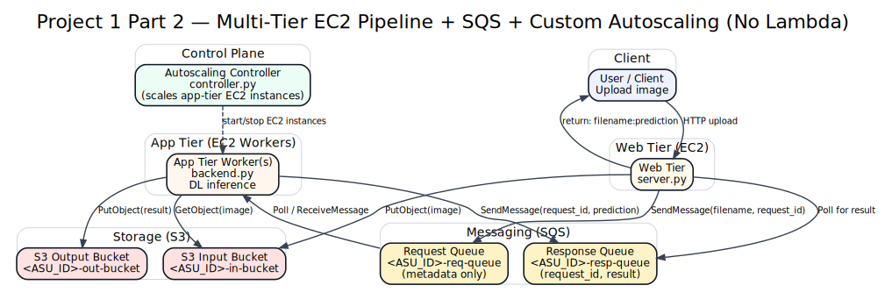

# CSE 546 Face Pipeline (Portfolio Copy)

This repository is a **sanitized portfolio copy** of my CSE 546 Cloud Computing face-recognition pipelines (AWS IaaS + Serverless + Edge/IoT).

> ✅ **No secrets included.** AWS keys, `credentials.txt`, and private key files (e.g., `*.pem`) were removed before committing.

---

## What’s inside

### Project 1 — IaaS (EC2 + S3 + SimpleDB/SQS)

**Part 1: Web tier (EC2)**
- Python web service (`server.py`) that:
  - accepts **HTTP POST** to `/` on **port 8000**
  - reads uploaded file from form key **`inputFile`**
  - stores the image into an S3 **input bucket**
  - performs *emulated inference* by looking up a **SimpleDB** domain
  - returns plaintext: `filename:prediction`
- Focus: AWS basics + concurrency in the web tier.

**Part 2: Multi-tier + autoscaling (EC2 + SQS + S3)**
- Web tier (`server.py`) remains the entrypoint and:
  - stores images in S3 (input bucket)
  - sends request metadata to an SQS **request queue** (message size constrained; image is NOT sent via SQS)
  - waits for result via an SQS **response queue**, then returns `filename:prediction`
- App tier (`backend.py`) runs on EC2 instances and:
  - pulls from request queue
  - fetches the image from S3 input bucket
  - runs a deep learning model for face recognition
  - writes results to an S3 **output bucket**
  - pushes results to response queue
- Custom autoscaling controller (`controller.py`) that scales app-tier instances up/down (no AWS Auto Scaling service).

---

### Project 2 — PaaS + Edge (Lambda/ECR + Greengrass + MQTT)

**Part 1: Serverless pipeline (Lambda + ECR + SQS)**
- Two Lambda functions (container image in ECR):
  - `face-detection` (invoked via **Function URL**) receives JSON with:
    - `content` (base64 frame), `request_id`, `filename`
    - runs MTCNN for face detection
    - pushes detected face jobs to SQS request queue
  - `face-recognition` (triggered by SQS):
    - runs FaceNet/InceptionResnetV1 for recognition
    - pushes `{ request_id, result }` to SQS response queue (polled by client)

**Part 2: Edge/IoT extension (Greengrass + MQTT + SQS + Lambda)**
- IoT client publishes base64 frames to MQTT topic:
  - `clients/<ASU-ID>-IoTThing`
- Greengrass Core runs a custom component:
  - `com.clientdevices.FaceDetection`
  - subscribes to that MQTT topic
  - runs MTCNN on the edge
  - sends detected faces to SQS request queue (cloud recognition remains in Lambda)
- Optional behavior (bonus in the class project): if **no face** is detected, edge can directly push `"No-Face"` to the SQS response queue.

---

## Repo layout

- `project1-part1-web-tier/`
- `project1-part2-app-tier/`
- `project2-part1-lambdas/`
- `project2-part2-edge/`
- `docs/` (security + high-level runbook)

---

## Security / Secrets

This repo does **not** include any AWS credentials or private keys.

See:
- `docs/SECURITY.md` (how this repo is sanitized + how to configure safely)
- `docs/RUNBOOK.md` (high-level deployment/testing notes)

---

## Tech stack

Python, AWS (EC2, S3, SQS, SimpleDB, Lambda, ECR), computer vision (MTCNN, FaceNet/InceptionResnetV1), IoT/Edge (Greengrass, MQTT).

---

## Architecture diagrams

### Project 1 Part 1 — EC2 Web Tier + S3 + SimpleDB

### Project 1 Part 2 — Multi-tier EC2 + SQS + Autoscaling Controller (No Lambda)

### Project 2 Part 1 — Serverless Pipeline (Lambda + SQS)

### Project 2 Part 2 — Edge (MQTT + Greengrass) + Cloud (SQS + Lambda)

