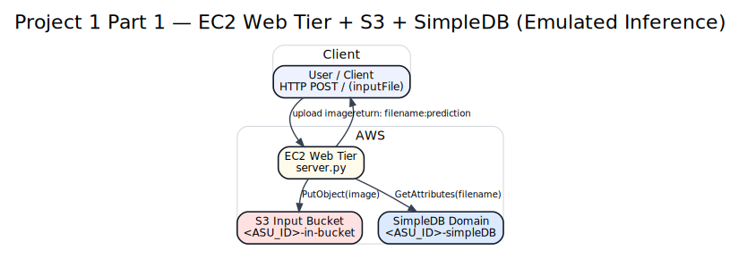

# Project 1 Part 1 — Web tier (EC2) + S3 + SimpleDB (emulated recognition)

## What it does
A Python web service that accepts HTTP POST to `/` (port 8000) with form key `inputFile`,
stores the image in an S3 input bucket, looks up the “prediction” in a SimpleDB domain,
and returns plaintext: `filename:prediction`.

## AWS resources (not currently deployed)
- S3 input bucket: `<ASU_ID>-in-bucket`
- SimpleDB domain: `<ASU_ID>-simpleDB`

## How to run (high-level)
1) Provision the AWS resources above in your own account.
2) Set env vars (see `.env.example` at repo root).
3) Run the server on an EC2 instance (or locally if you mock AWS calls).

## Notes
This repo is a portfolio copy; no AWS keys are included.

## Architecture

