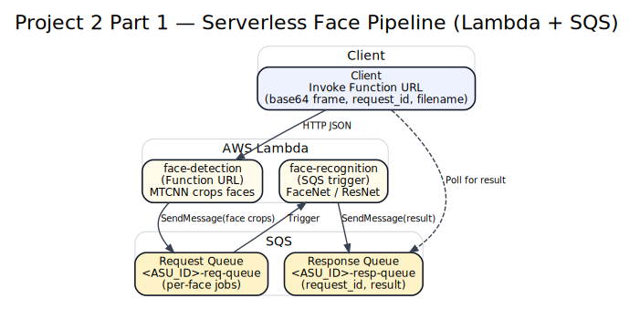

# Project 2 Part 1 - Serverless Face Pipeline (Lambda + SQS)

Two-stage Lambda pipeline: face detection is invoked by a Function URL, pushes detected faces to SQS, and a recognition Lambda reads from the queue and publishes results. This is a sanitized portfolio copy and is not deployed by default.

## Architecture

## How it works
- Client sends JSON to the face-detection Function URL with base64 `content`, `request_id`, and `filename`.
- Face detection runs MTCNN and sends a compact face crop to the SQS request queue.
- Recognition Lambda consumes the queue, runs FaceNet, and sends `{request_id, result}` to the response queue.

## How to run (high-level, not deployed now)
- Build and publish the Lambda container image (or zip) with ML dependencies.
- Create SQS request and response queues in your AWS account.
- Set environment variables for queue URLs and weights path, then deploy Lambdas.

## Config (env vars)
- `REQUEST_QUEUE_URL` (required for face-detection Lambda)
- `RESPONSE_QUEUE_URL` (required for face-recognition Lambda)
- `WEIGHTS_PATH` (default `/var/task/resnetV1_video_weights_1.pt`)

## What I learned / skills demonstrated
- Packaging ML inference for Lambda and managing cold starts.
- Designing a queue-based, decoupled serverless workflow.
