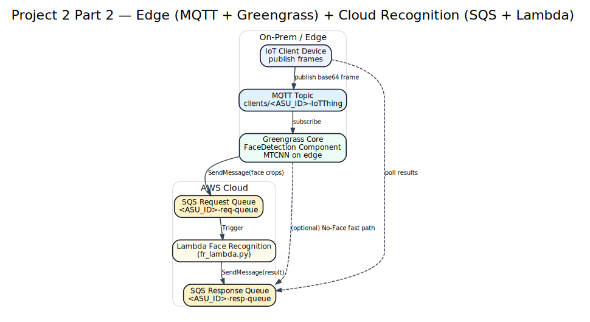

# Project 2 Part 2 — Edge extension (Greengrass + MQTT + SQS + Lambda)

## What it does
IoT device publishes base64 video frames to MQTT.
Greengrass Core runs a face-detection component (MTCNN) that consumes MQTT messages,
detects faces on the edge, and pushes work to the SQS request queue.
Cloud Lambda performs recognition and writes results to SQS response queue.

## MQTT message shape
JSON keys:
- `encoded`  : base64-encoded frame
- `request_id`: unique request identifier
- `filename` : image filename

## AWS resources (not currently deployed)
- IoT Core + Greengrass (core device)
- MQTT topic: `clients/<ASU_ID>-IoTThing`
- SQS request + response queues
- Lambda face-recognition (SQS trigger)

## Optional optimization
If no face is detected on the edge, respond directly with `"No-Face"` via the response queue.

## Notes
This repo is sanitized; no `.pem` or credentials are included.

## Architecture

